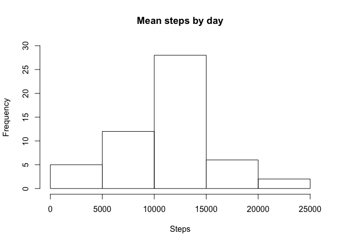
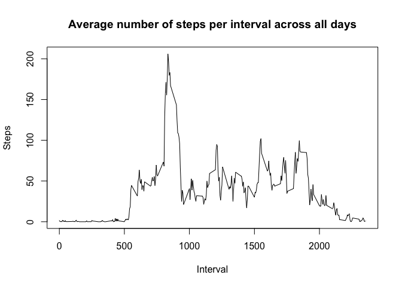
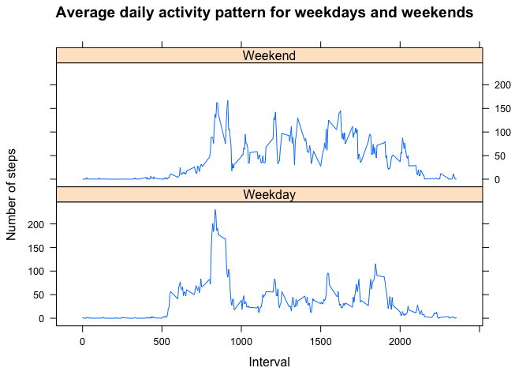

## Loading and preprocessing the data
To load the activity data, read.csv function was used. No preprocessing of the data was needed.

```r
act <-read.csv('activity.csv')
```

## What is the mean total number of steps taken per day?
### 1.Calculate the total number of steps taken per day
The mean total number of steps taken by day was calculated via the use of aggregate function. The missing values in the dataset were ignored by using na.omit.


```r
stepsbyday<-aggregate(act$steps, list(act$date), FUN=sum)
stepsbyday <-na.omit(stepsbyday)
```
### 2.Make a histogram of the total number of steps taken each day
The histogram of the total number of steps taken each day is presented below.

```r
hist(stepsbyday$x,xlab='Steps',main = 'Mean steps by day',ylim=range(0:30))
```

<!-- -->

### 3.Calculate and report the mean and median of the total number of steps taken per day
The mean and median of the total number of steps taken per day were calculated by the corresponding functions and the results are shown below.

```r
mean(stepsbyday$x)
```

```
## [1] 10766.19
```

```r
median(stepsbyday$x)
```

```
## [1] 10765
```

## What is the average daily activity pattern?

### 1. Make a time series plot of the 5-minute interval and the average number of steps taken, averaged across all days
To calculate the average daily activity pattern, again aggregate function was used.

```r
meaninterval <- aggregate(act$steps, list(act$interval), FUN=mean, na.rm=T)
plot(meaninterval$Group.1,meaninterval$x,type ='l',xlab='Interval',ylab='Steps',main = 'Average number of steps per interval across all days')
```

<!-- -->

### 2.Which 5-minute interval, on average across all the days in the dataset, contains the maximum number of steps?

To find the 5-minute interval with the maximum number of steps on average across all days in the dataset the following code was used:

```r
maxinterval <- meaninterval[which.max(meaninterval$x),1]
```

The 5-minute interval with the maximum number of steps was 835. 

## Imputing missing values

### 1. Calculate and report the total number of missing values in the dataset (i.e. the total number of rows with NAs)
The sum of the missing values in the dataset was found to be :

```r
sum(is.na(act$steps))
```

```
## [1] 2304
```

### 2. Devise a strategy for filling in all of the missing values in the dataset - Create a new dataset that is equal to the original dataset but with the missing data filled in.
The missing values in the dataset were replaced with the mean of the corresponding 5-minute interval across all the days, as calculated in the previous section. To this end, a new dataset that is equal to the original dataset was created and a column named 'meaninternal' was added to the new dataset.


```r
actNEW<-act
actNEW$meaninterval <- rep(meaninterval$x)
actNEW$steps[is.na(actNEW$steps)] <-actNEW$meaninterval[is.na(actNEW$steps)]
```

### 3. Make a histogram of the total number of steps taken each day and Calculate and report the mean and median total number of steps taken per day. Do these values differ from the estimates from the first part of the assignment? What is the impact of imputing missing data on the estimates of the total daily number of steps?

The mean total number of steps taken by day was re-calculated with the missing values replaced.

```r
stepsbydaynew<-aggregate(actNEW$steps, list(actNEW$date), FUN=sum)
```

The new histogram of the total number of steps taken each day with missing values imputed is shown below. 

```r
hist(stepsbydaynew$x,xlab='Steps',main = 'Mean steps by day with imputed missing values',ylim=range(0:40))
```

<!-- -->

The new mean and median of the total number of steps taken per day were calculated as :

```r
mean(stepsbydaynew$x)
```

```
## [1] 10766.19
```

```r
median(stepsbydaynew$x)
```

```
## [1] 10766.19
```

The mean value is equal to the previous calculation, which was expected as the missing values were replaced with the corresponding interval means. 
The median value is greater than the previous calculation by 1.19 steps and equal to the mean value. In this case, the new median is greater than the previous as the missing values were replaced by the corresponding interval means, and not with values lower than the mean, which would result in a lower new median than the previous one. 

## Are there differences in activity patterns between weekdays and weekends?

### 1.Create a new factor variable in the dataset with two levels – “weekday” and “weekend” indicating whether a given date is a weekday or weekend day
To create the new factor variable in the dataset indicating whether the date is a weeday or a weekend day, the following code was used :

```r
library(timeDate)
actNEW$weekday[isWeekday(as.Date(as.character(actNEW$date)), wday = 1:5)]<-'Weekday'
actNEW$weekday[!isWeekday(as.Date(as.character(actNEW$date)), wday = 1:5)]<-'Weekend'
actNEW$weekday<-as.factor(as.character(actNEW$weekday))
```

### 2.Make a panel plot containing a time series plot of the 5-minute interval and the average number of steps taken, averaged across all weekday days or weekend days.
The mean total number of steps taken for weekdays and weekend days separately was calculated via the use of aggregate function. To plot the panel of weekend/weekdays average daily activity pattern the lattice system was used.

```r
lista<-list()
lista[[1]]<-actNEW$interval
lista[[2]]<-actNEW$weekday
meanweekdays <- aggregate(actNEW$steps,lista,FUN=mean)
library(lattice)
xyplot(x ~ Group.1 | Group.2, data = meanweekdays,type='l', layout = c(1, 2),xlab='Interval',ylab='Number of steps',main='Average daily activity pattern for weekdays and weekends')
```

<!-- -->

We notice several differences in the average daily activity pattern between weekdays and weekends.
